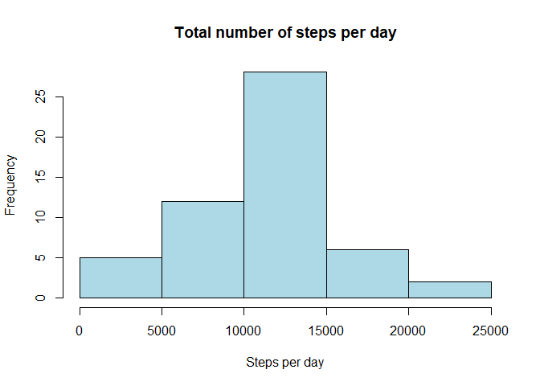
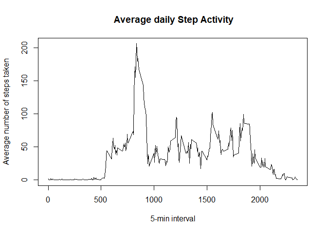
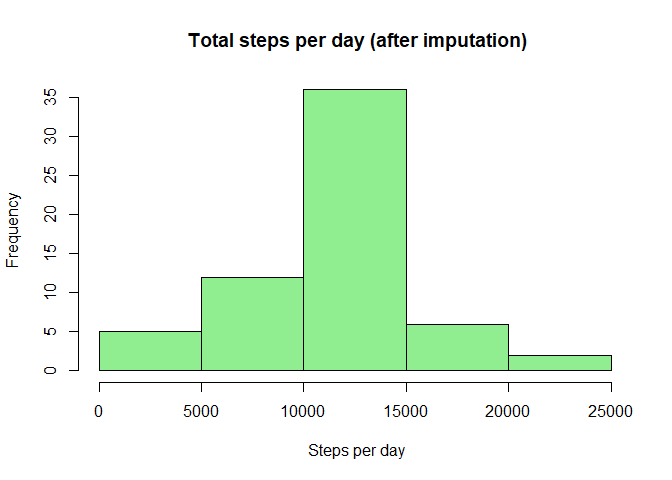
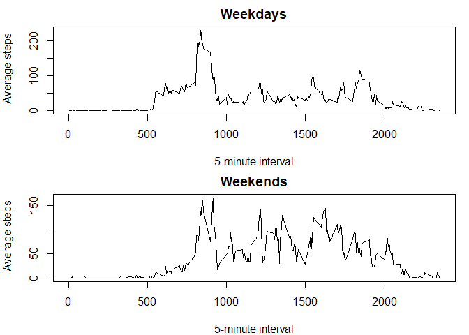

# Commit containing full submission

1. Code for reading in the dataset and/or processing the data


``` r
old.dir <- getwd()
setwd("C:/Users/User/OneDrive/Desktop Nvidia/DS notes/Chapter 5/Work 5.2")

data <- read.csv("activity.csv")
str(data)
```

```
## 'data.frame':	17568 obs. of  3 variables:
##  $ steps   : int  NA NA NA NA NA NA NA NA NA NA ...
##  $ date    : chr  "2012-10-01" "2012-10-01" "2012-10-01" "2012-10-01" ...
##  $ interval: int  0 5 10 15 20 25 30 35 40 45 ...
```

``` r
data$date <- as.Date(as.character(data$date))
data$interval <- as.integer(data$interval)
str(data)
```

```
## 'data.frame':	17568 obs. of  3 variables:
##  $ steps   : int  NA NA NA NA NA NA NA NA NA NA ...
##  $ date    : Date, format: "2012-10-01" "2012-10-01" ...
##  $ interval: int  0 5 10 15 20 25 30 35 40 45 ...
```

``` r
summary(data) # to check if there is NA
```

```
##      steps             date               interval     
##  Min.   :  0.00   Min.   :2012-10-01   Min.   :   0.0  
##  1st Qu.:  0.00   1st Qu.:2012-10-16   1st Qu.: 588.8  
##  Median :  0.00   Median :2012-10-31   Median :1177.5  
##  Mean   : 37.38   Mean   :2012-10-31   Mean   :1177.5  
##  3rd Qu.: 12.00   3rd Qu.:2012-11-15   3rd Qu.:1766.2  
##  Max.   :806.00   Max.   :2012-11-30   Max.   :2355.0  
##  NA's   :2304
```

2. Histogram of the total number of steps taken each day

``` r
activity_noNA <- subset(data,!is.na(steps))
steps_per_day <- aggregate(steps~date, data=activity_noNA, sum)
#plot
hist(steps_per_day$steps,
     main= "Total number of steps per day",
     xlab= "Steps per day",
     col = "lightblue")
```

<!-- -->

3. Mean and median number of steps taken each day

``` r
mean(steps_per_day$steps)
```

```
## [1] 10766.19
```

``` r
median(steps_per_day$steps)
```

```
## [1] 10765
```
4. Time series plot of the average number of steps taken

``` r
steps_per_interval <- aggregate(steps~interval, data=activity_noNA,mean)
#plot
plot(steps_per_interval$interval, steps_per_interval$steps,
     type="l",
     xlab= "5-min interval",
     ylab= "Average number of steps taken",
     main=" Average daily Step Activity")
```

<!-- -->
5. The 5-minute interval that, on average, contains the maximum number of steps

``` r
max_interval_value <- which.max(steps_per_interval$steps)
steps_per_interval$interval[max_interval_value]
```

```
## [1] 835
```
6. Code to describe and show a strategy for imputing missing data

``` r
total.NA <-  sum(is.na(data$steps))
interval_means <- aggregate(steps~interval,data=data,FUN=mean,na.rm=TRUE)
#Merge
activity_imputed <- merge(data,interval_means, 
                          by = "interval",
                          suffixes = c("",".mean"))
# If steps is NA, repalce by interval mean
activity_imputed$steps[is.na(activity_imputed$steps)] <- activity_imputed$steps.mean[is.na(activity_imputed$steps)]
# Drop hoelper column
activity_imputed_steps.mean <- NULL
str(activity_imputed)
```

```
## 'data.frame':	17568 obs. of  4 variables:
##  $ interval  : int  0 0 0 0 0 0 0 0 0 0 ...
##  $ steps     : num  1.72 0 0 0 0 ...
##  $ date      : Date, format: "2012-10-01" "2012-11-23" ...
##  $ steps.mean: num  1.72 1.72 1.72 1.72 1.72 ...
```

``` r
sum(is.na(activity_imputed$steps))
```

```
## [1] 0
```
7. Histogram of the total number of steps taken each day after missing values are imputed

``` r
steps_per_day_imputed <-  aggregate (steps~date, data=activity_imputed, sum)

hist(steps_per_day_imputed$steps,
     main = " Total steps per day (after imputation)", 
     xlab = " Steps per day",
     col  = "lightgreen")
```

<!-- -->
8. Panel plot comparing the average number of steps taken per 5-minute interval across weekdays and weekends

``` r
# create factor variable indicating weekdays & weekends
day_type <- function(d){
 wd <- weekdays(d)
 if (wd %in% c("Saturday","Sunday")) "weekend" else "weekday"
}  

activity_imputed$day_type <- factor(sapply(activity_imputed$date,day_type),levels = c("weekday","weekend"))

# average steps per interval for weekday vs weekends
steps_interval_daytype <- aggregate(steps~interval+day_type, 
                                    data= activity_imputed, FUN = mean)

par(mfrow = c(2,1), mar =c(4,4,2,1))

# plot
with(subset(steps_interval_daytype,day_type =="weekday"), 
     plot(interval, steps, 
          type = "l", 
          main ="Weekdays",
          xlab = "5-minute interval",
          ylab =" Average steps"))

with(subset(steps_interval_daytype,day_type =="weekend"), 
     plot(interval, steps, 
          type = "l", 
          main ="Weekends",
          xlab = "5-minute interval",
          ylab =" Average steps"))
```

<!-- -->

This is the assigment for Chapter 5.2 Coursera From JHU. 

